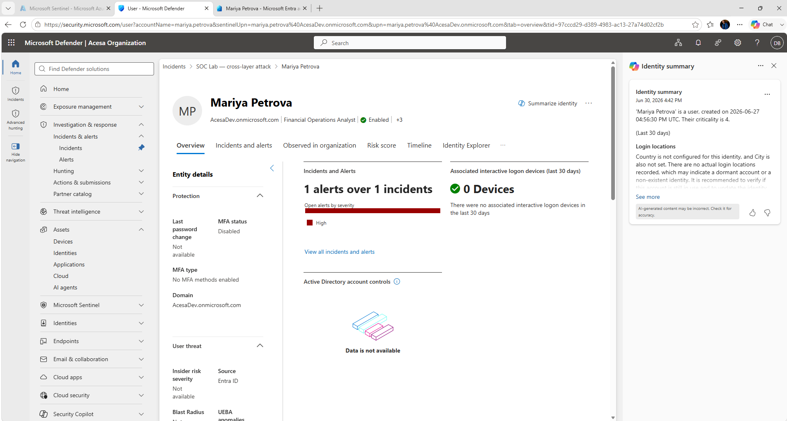
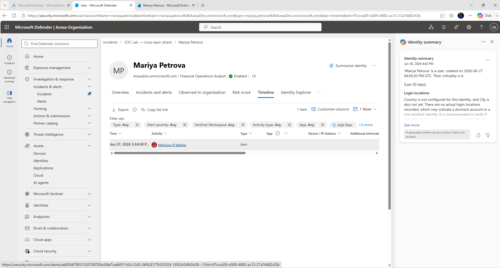

# Task 02 - Confirm suspicious sign-in activity and lateral movement (Defender for Identity)

## Introduction

Your KQL hunt placed all five stages, but two of them — the **identity compromise** (Stage 1) and the **lateral movement toward AI infrastructure** (Stage 4) — are where Defender for Identity adds detail the raw tables can't. Defender for Identity reconstructs an *account-centric* story: it builds a per-user timeline, surfaces the Entra ID Protection risk detection for the suspicious sign-in, and traces how a compromised identity moves. Confirming Stages 1 and 4 here corroborates your reconstruction with a second, independent view and gives you the entity timelines you'll attach to the response actions in Exercise 03.

## Description

You will use Defender for Identity inside the unified SecOps portal to confirm the **Stage 1 anonymous IP sign-in** for Mariya Petrova and the **Stage 4 lateral movement** by `sp-refund-agent-inference` toward the AI/GPU inference infrastructure. You'll read each entity's timeline and alerts and reconcile what they show against the entities you captured in Task 01.

## Success Criteria

- You have opened Mariya Petrova's identity timeline and confirmed the anonymous IP sign-in from `102.89.42.17` _(Validation: Stage 1 anonymous IP detection confirmed in Defender for Identity)_
- You have confirmed the Stage 4 lateral-movement activity for `sp-refund-agent-inference` reaching toward `rg-soclab` _(Validation: Stage 4 lateral movement confirmed)_
- The entities match the lifecycle you assembled in Task 01 (and you've noted any discrepancies to resolve)

## Learning Resources

- [What is Microsoft Defender for Identity?](https://learn.microsoft.com/en-us/defender-for-identity/what-is){:target="_blank"}
- [Investigate users in Microsoft Defender XDR](https://learn.microsoft.com/en-us/defender-xdr/investigate-users){:target="_blank"}
- [Microsoft Defender for Identity security alerts](https://learn.microsoft.com/en-us/defender-for-identity/alerts-overview){:target="_blank"}
- [Lateral movement paths in Defender for Identity](https://learn.microsoft.com/en-us/defender-for-identity/understand-lateral-movement-paths){:target="_blank"}
- [Investigate Microsoft Entra IP addresses with Defender for Identity](https://learn.microsoft.com/en-us/defender-for-identity/investigate-entra-id-ip-addresses){:target="_blank"}

## Key Tasks

{: .warning }
> **Build note:** Defender for Identity's account-centric view depends on real Entra ID objects and sign-in telemetry being provisioned in the tenant. Mariya Petrova (`mariya.petrova@AcesaDev.onmicrosoft.com`) and `sp-refund-agent-inference` must exist as real identities with baseline sign-in history; the `anonymousIpAddress` detection (Stage 1) requires a sign-in from a Tor exit node or known anonymous proxy registered against Mariya's account. The exact alert titles ("Anonymous IP address", "Suspicious additions to sensitive groups", service-principal anomaly wording) and which activities surface on the timeline will be confirmed during the build. If an entity page shows no timeline, verify the identity connector and the provisioned sign-in data are present before treating it as a finding.

### 01: Open Mariya Petrova's identity timeline

Pull up the account-centric view for the compromised user.

<strong>Expand this section for detailed steps</strong>

1. In the Defender portal, open the **SOC Lab — cross-layer attack** incident and select the **Assets** tab. Under **Users**, click **Mariya Petrova** — this opens a flyout panel showing her overview, risk score, and open incidents.

2. At the bottom of the flyout, click **Go to user page**. This opens Mariya's full Defender entity page with the complete tab set.

3. Review the **Overview** tab: account type, group memberships, and risk indicators. This is the baseline the suspicious sign-in violates.

   

### 02: Confirm the Stage 1 anonymous IP sign-in

Verify the sign-in from anonymous infrastructure and link it to the attacker IP.

<strong>Expand this section for detailed steps</strong>

1. On Mariya's full entity page, select the **Timeline** tab. Confirm there is a **Malicious IP address** alert entry — this is the Entra ID Protection risk detection that corroborates Stage 1. The alert type may appear as **Malicious IP address** or **Anonymous IP address** depending on how Microsoft threat intelligence classifies the IP in your tenant; both indicate the same suspicious sign-in pattern.

2. Note the alert date and time — this confirms that the Stage 1 sign-in from `SocLabEvents_CL` is independently flagged on Mariya's identity timeline in Defender for Identity.

3. Reconcile against Task 01: the detection on Mariya's timeline corroborates the Stage 1 identity event. Note any discrepancies so they don't read as contradictions later.

   

### 03: Reconcile both stages against your lifecycle

Fold the corroboration back into the reconstruction.

<strong>Expand this section for detailed steps</strong>

1. Update your Task 01 lifecycle table: mark Stage 1 as **corroborated in Defender for Identity** via the Malicious IP address alert on Mariya's timeline. Stage 4 corroboration comes entirely from `SocLabEvents_CL` — the `sp-refund-agent-inference` service principal has no Defender for Identity profile in this tenant.

2. Note explicitly what Defender for Identity **did not** show: it is account-centric and has no visibility into Stage 2 (grounding poisoning) or Stage 3 (Refund Agent prompt-injection). That absence is not a failure of the tool, and it does **not** mean the AI attack went undetected — the AI stage raised a **real Defender for Cloud — AI threat protection alert** (the one you surfaced in Task 01). The problem is that the AI alert lived in a different surface and was **never correlated** into this account-centric story — exactly the cross-layer gap you'll formalize in Task 03.

## Summary

Congratulations! Using Defender for Identity you corroborated Stage 1: the Malicious IP address alert on Mariya Petrova's timeline independently confirms the suspicious sign-in from `SocLabEvents_CL`. Stage 4 is corroborated by KQL alone — the `sp-refund-agent-inference` service principal has no Defender for Identity profile in this tenant. You also confirmed what this account-centric view can't see — the AI-layer stages, whose real Defender for Cloud AI alert sat in a separate, uncorrelated surface — which sets up the gap analysis you do next.
